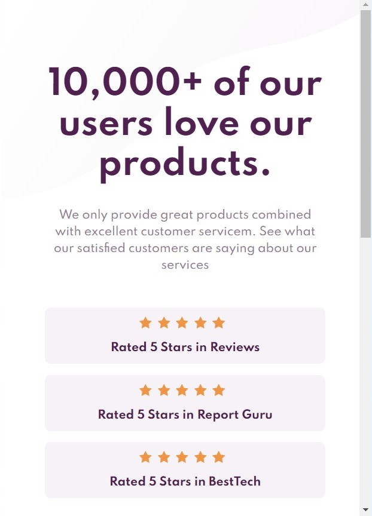
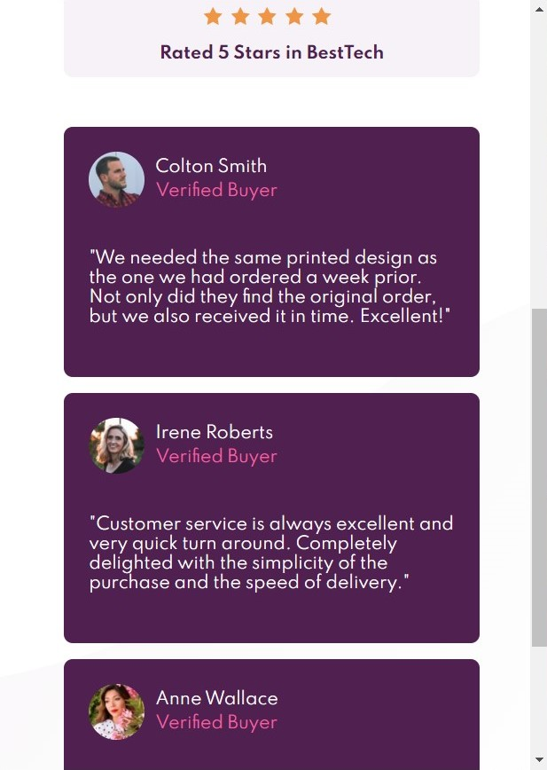
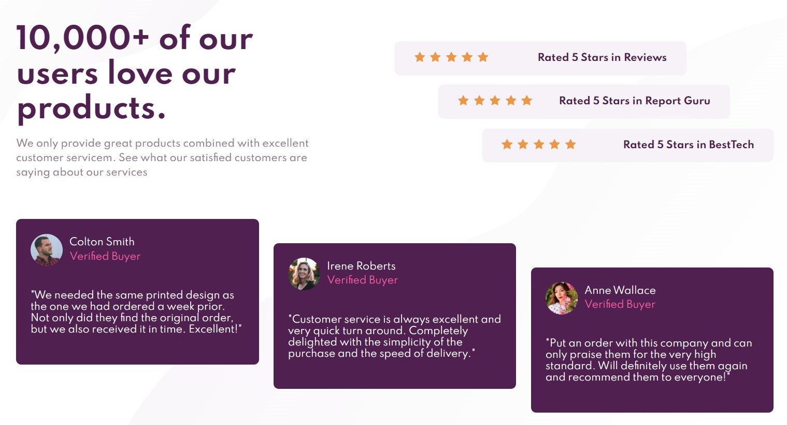

<h1 align="center">Social Proof</h1>

# 💻 Sobre o projeto

Social Proof é uma tela com o objetivo de atrair novos usuários utilizando a opinião de outros a respeito dos serviços prestados aos mesmos.

<h3 align="center"> 
	🚧 🚀 Status de Andamento do Projeto: Finalizado. 🚧
</h3>

## Desafíos e Estudos Relevantes:

- Controle incrível a respeito do posicionamento de componentes em tela.
- Exemplificação e treino utilizando pseudo-classes para estilização de componentes.
- Reponsividade que torna o projeto adaptável a diversas telas de dispositivos utilizando @MediaQuery. 
- Trabalho com multiplas imagens para a construção de um plano de fundo mais bonito e diferenciado.
- Utilização de Rem e % como principais unidades medidas para maximizar capacidade responsiva dos elementos.

 
    Os Design e Icones desta tela são disponibilizados pela plataforma 
    <a href="https://www.frontendmentor.io/solutions">Frontend Mentor</a>.
    A mesma propõe que desenvolvedores busquem projetar as telas solicitadas o mais próximo possível do design esperado. É um bom desafio!  

# 🛠 Tecnologias

As seguintes tecnologias foram utilizadas na construção do projeto:

- [ReactJS](https://pt-br.reactjs.org/docs/getting-started.html)
- [HTML](https://developer.mozilla.org/pt-BR/docs/Web/HTML)
- [CSS3](https://developer.mozilla.org/pt-BR/docs/Web/CSS)
- [JavaScript](https://developer.mozilla.org/pt-BR/docs/Web/JavaScript)

# 🎨 Layout

## Mobile

 
    
    

## Desktop

 
    

## Apresentação

 
    

# Autor
Feito por Gabriel Brito ❤️👋🏽
 
